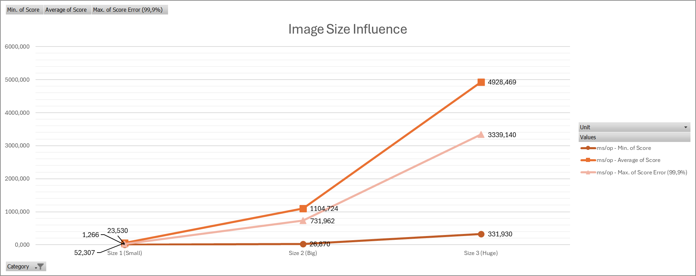
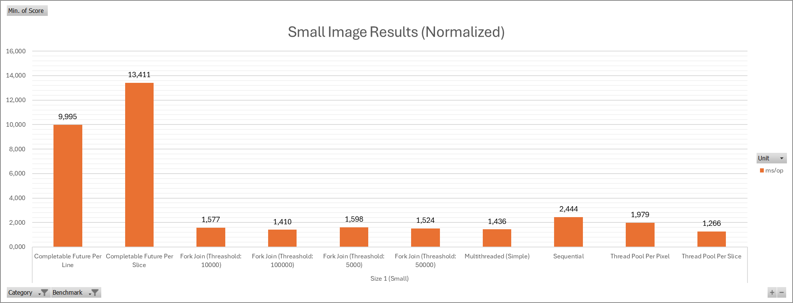
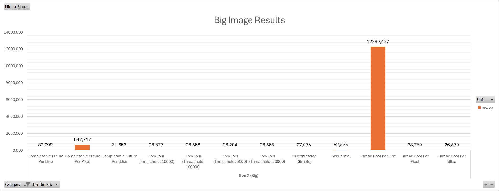
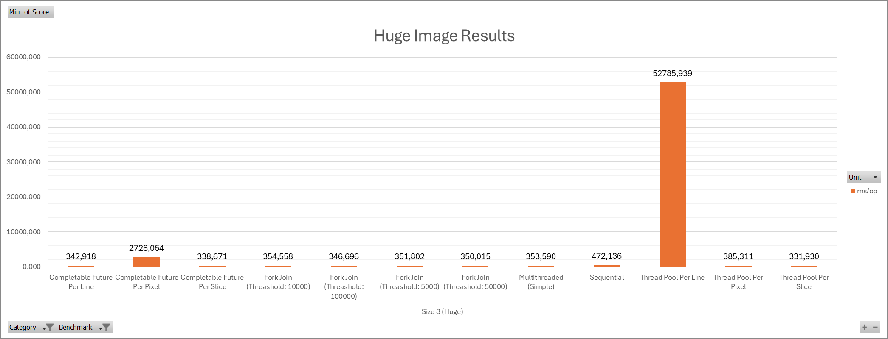
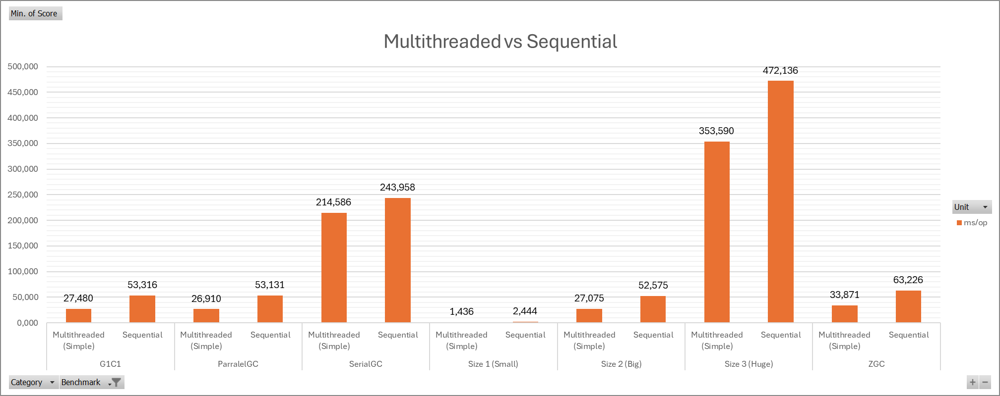
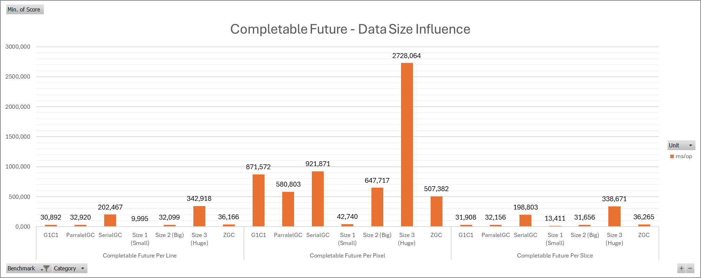
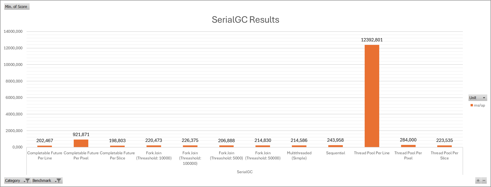
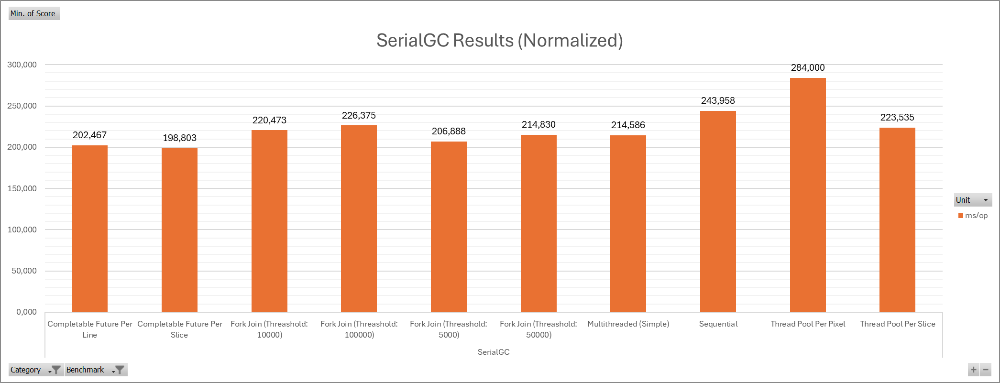
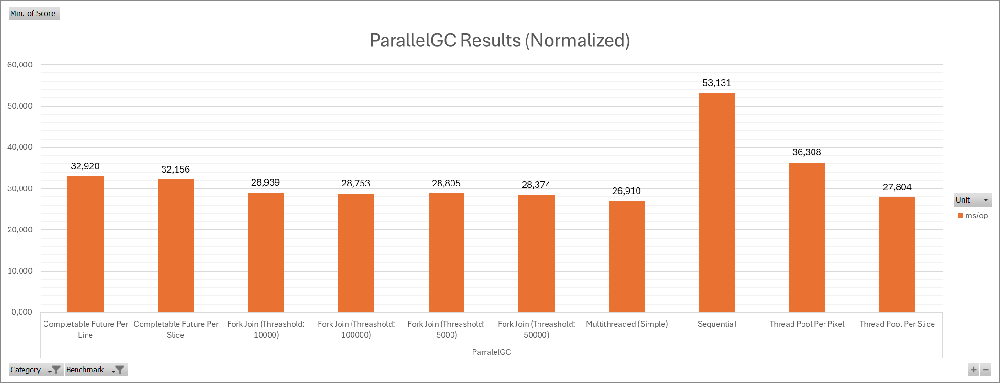
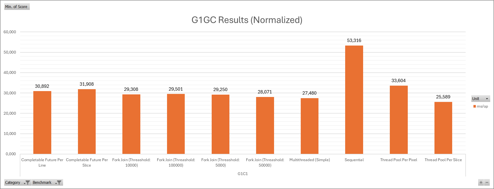

# Parallel Digital Image Processing and Analysis

This project explores various parallel processing approaches for image analysis, being sequential-based, multithreaded-based, executor-based, forkJoinPool-based and finally a completableFutures-based implementation. In this document, we'll discuss each approach, provide code snippets, and present benchmark results to compare their performance across different image sizes and garbage collectors. In cases where an approach could have other alternatives for implementations, these will also be discussed along with their pros and cons and why we eventually choose the approach we did.

## Development Approach, Executors and Benchmarking Methodology

In this chapter, we outline the methodology used for benchmarking and the approach taken in the development of the solutions for parallel image processing.

### Development Approach

The digital processing of an image can be split into three steps. The conversion from image to data, the transformation of the data and finally the conversion to an image again.
Since an image in composed of pixels, an image can be converted to a matrix of pixels or colours, with width x and height y, and this is what is done in the first step.
For the second step, each pixel with coordinates _i_, _j_, where _i_ is the row and _j_ the column, is calculated from the initial image.
Taking this into account, a Filter interface can be established that represents the minimal behaviour of all filters which will be developed.

```java
public interface Filter {
    Color apply(int i, int j, Image image);
}
```

With the usage of an interface that establishes the minimal behaviour of a filter, we can then implement the FilterExecutor which are the different solutions (Sequential, Multithreaded, ThreadPool-based) for the problem. These executors should, given an image, return back a new image, which has been processed.

```java
public interface FilterExecutor {
    Image apply(Image image);
}
```

### Executors

#### Sequential

```java
@Override
public Image apply(Image image) {
    Color[][] pixelMatrix = new Color[image.height()][image.width()];
    for (int i = 0; i < image.height(); i++) {
        for (int j = 0; j < image.width(); j++) {
            pixelMatrix[i][j] = filter.apply(i, j,image);
        }
    }
    return new Image(pixelMatrix);
}
```

Simple sequential approach that iterates through every pixel and applied the filter.

#### Multithreaded

```java
private class AlgorithmRunner implements Runnable {

    private final int lowerWidthBound;
    private final int higherWidthBound;
    private final Color[][] sharedOutput;
    private final Image imageToProcess;
    private final Filter filter;

    public AlgorithmRunner(int lowerWidthBound, int higherWidthBound,
                           Color[][] sharedOutput, Image imageToProcess, Filter filter) {
        this.lowerWidthBound = lowerWidthBound;
        this.higherWidthBound = higherWidthBound;
        this.sharedOutput = sharedOutput;
        this.imageToProcess = imageToProcess;
        this.filter = filter;
    }

    @Override
    public void run() {
        for (int i = 0; i < imageToProcess.height(); i++) {
            for (int j = lowerWidthBound; j < higherWidthBound; j++) {
                sharedOutput[i][j] = this.filter.apply(i, j,imageToProcess);
            }
        }
    }
}
```

The multithreaded approach consists in creating threads according to the number of available processors, dividing the image equally for each thread and create, run and join the threads.

#### Executors

```java
@Override
public Image apply(Image image) {
    Color[][] pixelMatrix = new Color[image.height()][image.width()];
    final int numberOfThreads = Runtime.getRuntime().availableProcessors();
    final int sliceHeight = image.height() / numberOfThreads;
    for (int i = 0; i < numberOfThreads; i++) {
        final int sliceStartX = i * sliceHeight;
        final int sliceEndX = (i == numberOfThreads - 1) ? image.height() : (i + 1) * sliceHeight;
        threadPool.submit(() -> {
            for (int x = sliceStartX; x < sliceEndX; x++) {
                for (int y = 0; y < image.width(); y++) {
                    final Color filteredPixel = filter.apply(x, y, image);
                    pixelMatrix[x][y] = filteredPixel;
                }
            }
        });
    }
    threadPool.shutdown();
    try {
        if (!threadPool.awaitTermination(100, TimeUnit.SECONDS)){
            System.out.println("Timeout occurred.");
        }
    } catch (InterruptedException ignored) { }

    return new Image(pixelMatrix);
}
```

The executors approach consists in dividing the image in a certain way (slices, lines, pixel) and submitting it to the thread pool.

#### ForkJoin

```java
@Override
protected void compute() {
    if ((endRow - startRow) * (endCol - startCol) <= threshold) {
        for (int i = startRow; i < endRow; i++) {
            for (int j = startCol; j < endCol; j++) {
                sharedOutput[i][j] = filter.apply(i, j, imageToProcess);
            }
        }
    } else {
        int midRow = (startRow + endRow) / 2;
        int midCol = (startCol + endCol) / 2;

        invokeAll(
                new FilterTask(startRow, midRow, startCol, midCol, sharedOutput, imageToProcess, filter),
                new FilterTask(startRow, midRow, midCol, endCol, sharedOutput, imageToProcess, filter),
                new FilterTask(midRow, endRow, startCol, midCol, sharedOutput, imageToProcess, filter),
                new FilterTask(midRow, endRow, midCol, endCol, sharedOutput, imageToProcess, filter)
        );
    }
}
```

The fork join approach consists in dividing the image in 4 quarters recursively until the image is small enough to be processed (is less or equals then the threshold). The threshold is the number of pixels of an image.

#### CompletableFuture

```java
@Override
public Image apply(Image image) {
    final Color[][] pixelMatrix = new Color[image.height()][image.width()];
    for (int x = 0; x < image.height(); x++) {
        final int finalX = x;
        CompletableFuture.runAsync(() -> {
            for (int y = 0; y < image.width(); y++) {
                final Color filteredPixel = filter.apply(finalX, y, image);
                pixelMatrix[finalX][y] = filteredPixel;
            }
        });
    }
    if(!ForkJoinPool.commonPool().awaitQuiescence(100, TimeUnit.SECONDS)){
        System.out.println("Timeout occurred.");
    }
    return new Image(pixelMatrix);
}
```

The completable future approach consists in dividing the image in a certain way (slices, lines, pixel) and submitting it to the ForkJoin common pool.

### Benchmarking Methodology

To evaluate the performance of each filter, we utilized the Java Microbenchmarking Harness library. This tool enabled us to create and execute benchmarks effortlessly. Each benchmark included warm-up iterations followed by actual iterations that contributed to the final result. We configured the score type to measure the average time in milliseconds for each operation (filter) to run. Additionally, we formatted the output into CSV for easy analysis.

```java
@State(Scope.Benchmark)
@BenchmarkMode(Mode.AverageTime)
@OutputTimeUnit(TimeUnit.MILLISECONDS)
public class BaseBenchmark {

    @Param("src/main/resources/imgs/turtle.jpg")
    private String pathToFile;

    @Param("pt.ipp.isep.dei.sismd.filters.BrighterFilter")
    private String filterName;

    private Filter filter;

    private Image image;

    @Setup
    public void setup() {
        filter = (Filter) getInstance(filterName);
        image = Utils.loadImage(new File(pathToFile));
    }

    @Benchmark
    public Image sequential() {
        return new SequentialExecutor(filter).apply(image);
    }

    @Benchmark
    public Image multithreaded() {
        return new MultithreadedExecutor(filter).apply(image);
    }
  ...
}
```

A base benchmark was created that received a filter and image as parameter and executes the benchmarks foreach image processing algorithm and generates a csv.

```java
    return new OptionsBuilder()
                .include(BaseBenchmark.class.getSimpleName())
                .param("pathToFile", "src/main/resources/imgs/"+ ImageSize.big.name() + "/4k_background.jpg")
                .param("filterName", filter)
                .jvmArgs("-XX:+Use" + gc.name())
                .warmupIterations(3)
                .forks(1)
                .resultFormat(ResultFormatType.CSV)
                .result("report/benchmark_results/"+ getSimpleFilterName(filter) + "/" + gc.name().toLowerCase().replace("gc", "") + "/" + System.currentTimeMillis() + ".csv")
                .build();
```

As can be seen above, jmh can fork the JVM, i.e. create another jvm, and it allows us to pass jvmArgs. We used that functionality to dynamically pass different GC types and execute the benchmarks.

## Brighter Filter

The goal of the brighter filter is to increment the brightness of each pixel by a specific ammount.
To calculate the brightness of each pixel, a mask must be used to combine the saturation of each color on each pixel,
calculting the average of the saturation, being that the brightness of said pixel.
To increment the brightness of any pixel, is just incrementing the value of each color by a specific ammount.
That said, the amount increase must be equal in all three colors, otherwise a hue shift is present, instead of a brightness,
culminating in the code exercerpt bellow.

```java

@Override
public Color apply(int i, int j, Image image) {
    Color color = image.obtainPixel(i, j);
    return new Color(Math.min(color.red() + brightness, MAX_HUE_VALUE),
            Math.min(color.green() + brightness, MAX_HUE_VALUE),
            Math.min(color.blue() + brightness, MAX_HUE_VALUE));
}
```

Moreover, it is important to understand that the implementation of the filter alone does not garantee the fastest
execution of said filter; there are many factors that influence the executions, increasing (or decreasing) the overall
velocity of the implementation.

As a result, a carfull and exaustive metric collection was performed to understand which factors influence positivelly
our implementations and which are detrements to our overall goal.
Thus, the metrics were divided using:

* Four categories of images to determine velocity scalability;
* Four garbage collectors to view how Java GCs may influence the overall performance;
* Five execution methods to see which implementation on each JGC is the best approach.

To make conclusions on the [extracted metrics](./benchmark_results/brighter/Brighter-Results.xlsx), Excel was used to generate useful charts that
increase the compreenshion of the results.

### Image Size

Since with increasing images size in the industry, it is relevant to analyze how diferent images size may
influence the performance of all or results.



With the increment of image size, it is inevitable that the time of processing and filter application increases, however,
it is important to understand that the time increases exponentially.

Furthermore, it is important to normalize the data to properly scale and measure aproaches.

#### Small (Approx. 700x500 px)




As expected, since the ammount of work in small images is relatively small, there is not a huge desparity in startegies
efficiency. Nevertheless, it is important to point out that two strategies come out as incredibly attrocious in terms of efficiency,
necessitating to excluded them from certain alnalysis (Thread Pool per Line and Completable Futures per pixel ).

#### Big (Approx. 3840x2160 px)




Differently from the [small image sizes](#small-approx-700x500-px), the results from
this size of images favour thread pool approaches, having the Thread Pool Per Slice method as the best methodology
for this filter.

#### Huge (Approx. 7300x4900 px)




No different results can be interpreted from this data comparing it to the [results obtained with big images](#big-approx-3840x2160-px)

#### Conclusion

It is suprising that the Fork Join and Completable Futures approaches be worse than the
Thread Pool based, however, certain factors may explain this discrepancy, maybe for certain image sizes,
the memory that needs allocation may be a bigger detriment to the execution versus the benefits those aproches bring.
Other possible factor may well be the garbage collectors that may be more consistent with the thread pool aproach vs the others,
making it possible to have a combination of a garbage collector with fork join / completable futures that may indeed be
a better approach, but this topic will be better explored in [Garbage Collectors](#garbage-collectors) section.

### Strategies

#### Sequential vs Multithreaded (Simple)



#### Thread Pool


#### Fork Join


#### Completable Futures



#### Conclusion

In conclusion, the hipotesis raised in the previous section were wrong. The thread pool approach is indeed the best aproach
and the most versitile for the Brighter Filter.

### Garbage Collectors


Comparison between different garbage collectors

#### SerialGC





#### ParallelGC




#### G1GC




#### ZGC


#### Conclusion

Having all that in mind, plus the other intrem conclusions, the best choice for this filter is the combination
of the Thread Pool Per Slice with G1 Garbage Collector.

## Grayscale

The grayscale filter converts a color image into a grayscale image by averaging the red, green, and blue components of each pixel and replacing them with the computed average.

The filter was implemented as follows:

```java
@Override
public Color apply(int i, int j, Image image) {
  Color pixel = image.obtainPixel(i, j);
  int r = pixel.red();
  int g = pixel.green();
  int b = pixel.blue();

  int sum = r + g + b;
  int avg = sum / 3;

  return new Color(avg, avg, avg);
}
```

### Comparison between different image sizes

In this section, the different image processing approaches will be compared with different image sizes.

#### Small

|Benchmark                |Mode|Samples|Score     |Score Error (99.9%)|Unit |
|-------------------------|----|-------|----------|-------------------|-----|
|forkjoin_100000          |avgt|5      |0.934713  |0.028747           |ms/op|
|forkjoin_50000           |avgt|5      |1.008926  |0.015426           |ms/op|
|executorsPerSlice        |avgt|5      |1.020407  |0.018698           |ms/op|
|multithreaded            |avgt|5      |1.337218  |0.037856           |ms/op|
|forkjoin_10000           |avgt|5      |1.339378  |0.028556           |ms/op|
|sequential               |avgt|5      |1.357654  |0.041508           |ms/op|
|forkjoin_5000            |avgt|5      |1.381923  |0.178934           |ms/op|
|executorsPerLine         |avgt|5      |1.393742  |0.160871           |ms/op|
|completableFuturePerLine |avgt|5      |2.480876  |0.348970           |ms/op|
|completableFuturePerSlice|avgt|5      |13.857710 |1.502096           |ms/op|
|completableFuturePerPixel|avgt|5      |40.811620 |1.952428           |ms/op|
|executorsPerPixel        |avgt|5      |395.049808|22.414668          |ms/op|

By looking at the table above for the grayscale filter on small images, we can observe the following:

* ForkJoin with 100000 pixels threshold or recursion stop condition, was the fastest. Given that the image has ~360000 pixels (696x522), the algorithm divided the image in four quadrants(~90000 pixels each) and created one fork for each quadrant, the forks hit the recursion stop condition and executed the filter (fork tree with 1 of height before join).

* ForkJoin with 50000 pixels threshold or recursion stop condition was the second fastest. The only difference between this approach and the first, is that this approach divided the image in 4 quadrants twice, or in other words the height of the fork tree was two before join.

* Executors per slice was the third fastest.

* Sequential was faster than a few parallel approaches.

* The approaches that send individual pixels to a thread pool are bad.

### Big

|Benchmark                |Mode|Samples|Score     |Score Error (99.9%)|Unit |
|-------------------------|----|-------|----------|-------------------|-----|
|executorsPerSlice        |avgt|5      |15.240269 |0.126980           |ms/op|
|multithreaded            |avgt|5      |15.586608 |0.177745           |ms/op|
|completableFuturePerLine |avgt|5      |17.087186 |0.134427           |ms/op|
|completableFuturePerSlice|avgt|5      |17.127829 |0.031357           |ms/op|
|forkjoin_5000            |avgt|5      |17.366676 |0.220619           |ms/op|
|forkjoin_10000           |avgt|5      |17.382759 |1.483773           |ms/op|
|executorsPerLine         |avgt|5      |17.524300 |0.888894           |ms/op|
|forkjoin_100000          |avgt|5      |17.628387 |0.320718           |ms/op|
|forkjoin_50000           |avgt|5      |17.835574 |0.077437           |ms/op|
|sequential               |avgt|5      |32.687705 |0.899930           |ms/op|
|completableFuturePerPixel|avgt|5      |1092.575795|175.570869         |ms/op|
|executorsPerPixel        |avgt|5      |8796.253290|312.901461         |ms/op|

By looking at the table above for the grayscale filter on big images, we can observe the following:

* Executors per slice is the best. This approach divides the image in horizontal slices according to the number of available processors and then sends each slice to the thread pool to be executed.

* Multithreaded is the second best. This approach is basically the same as the approach above regarding the task division, the only difference is that the threads are created to do the exact task as opposed to look for tasks in a queue.

* Completable future per line is the third best.

* Sequential was faster than the parallel approaches that send individual pixels to a thread pool.

* The approaches that send individual pixels to a thread pool are bad.

#### Huge

|Benchmark                |Mode|Samples|Score     |Score Error (99.9%)|Unit |
|-------------------------|----|-------|----------|-------------------|-----|
|completableFuturePerLine |avgt|5      |236.841961|15.426141          |ms/op|
|executorsPerSlice        |avgt|5      |237.148008|32.849460          |ms/op|
|completableFuturePerSlice|avgt|5      |240.266058|12.976349          |ms/op|
|multithreaded            |avgt|5      |245.229084|12.045064          |ms/op|
|forkjoin_10000           |avgt|5      |246.728081|33.752774          |ms/op|
|forkjoin_100000          |avgt|5      |247.807731|30.465241          |ms/op|
|forkjoin_50000           |avgt|5      |249.654975|13.180316          |ms/op|
|forkjoin_5000            |avgt|5      |250.966523|21.089158          |ms/op|
|executorsPerLine         |avgt|5      |257.785994|16.719379          |ms/op|
|sequential               |avgt|5      |320.958291|14.450783          |ms/op|
|completableFuturePerPixel|avgt|5      |6041.618260|657.716907         |ms/op|
|executorsPerPixel        |avgt|5      |39645.233020|1312.374901        |ms/op|

By looking at the table above for the grayscale filter on huge images, we can observe the following:

* The score errors are higher, possibly indicating that some interference happened during the benchmark execution. Score errors are calculated based on the score variability between iterations.

* Completable future per line is the fastest. This algorithm distributes image lines between the fork join common pool worker thread queues. Each thread processes a line, if one thread finishes, it performs work stealing by getting tasks on other worker queue.

* Executors per slice is the second fastest. It was the fastest in big images.

* Completable future per slice is the third fastest.

* Sequential was faster than the parallel approaches that send individual pixels to a thread pool.

* The approaches that send individual pixels to a thread pool are bad.

#### Analysis

* **Top 3 most consistent:**

  * **Executors Per Slice:** This approach exhibits relatively low variance in its scores across different image sizes. The difference in execution times between small, big, and large images is comparatively minimal, indicating consistent performance regardless of image size.

  * **Multithreaded:** While multithreaded may not be the fastest approach for all image sizes, it demonstrates consistency in its performance across different image sizes. The variance in execution times is relatively low, indicating stable performance across varying workloads.

  * **CompletableFuture Per Line:** This approach presented the best performance for huge images and the third-best performance for big images.

* **Best approach:** In this case, **executorsPerSlice** demonstrated the best overall performance across all image sizes.

* **Sequential vs. Parallel:** In all cases, the sequential approach consistently shows higher execution times compared to parallel processing approaches, highlighting the benefits of parallelization for image processing tasks.

### Comparison between different garbage collectors

The following table presents benchmarking results for different garbage collectors (SerialGC, ParallelGC, G1GC, and ZGC) across various approaches for image processing measured in milliseconds per operation/iteration (ms/op).

|Benchmark                |Mode|Samples|SerialGC Score|SerialGC Score Error (99.9%)|ParallelGC Score|Parallel Score Error (99.9%)|G1GC Score     |G1GC Score Error (99.9%)                |ZGC Score  |ZGC Score Error (99.9%)|Unit |
|-------------------------|----|-------|--------------|----------------------------|----------------|----------------------------|---------------|----------------------------------------|-----------|-----------------------|-----|
|completableFuturePerLine |avgt|5      |170.16738     |15.369149                   |17.740941       |0.352113                    |16.965467      |0.352488                                |29.890874  |1.707477               |ms/op|
|completableFuturePerPixel|avgt|5      |1741.096825   |546.391102                  |939.426457      |573.684246                  |913.370614     |145.53076                               |1016.344319|265.13321              |ms/op|
|completableFuturePerSlice|avgt|5      |157.986777    |45.405342                   |17.388427       |0.106535                    |16.335226      |0.146891                                |31.598553  |0.575226               |ms/op|
|executorsPerLine         |avgt|5      |220.096692    |62.121497                   |19.71269        |1.357153                    |17.671658      |0.781633                                |23.250907  |0.587853               |ms/op|
|executorsPerPixel        |avgt|5      |9398.65168    |126.810069                  |9241.54823      |421.617234                  |9039.14179     |86.776574                               |9030.09091 |130.845958             |ms/op|
|executorsPerSlice        |avgt|5      |189.19363     |36.030961                   |17.734547       |8.513789                    |14.88514       |0.125666                                |20.495219  |0.418538               |ms/op|
|forkjoin_10000           |avgt|5      |163.942459    |64.510089                   |18.333726       |0.314625                    |17.219912      |0.14072                                 |22.130946  |0.42398                |ms/op|
|forkjoin_100000          |avgt|5      |173.612169    |24.914418                   |18.328521       |0.573699                    |17.687689      |0.143305                                |21.974032  |0.533229               |ms/op|
|forkjoin_5000            |avgt|5      |151.196349    |73.222758                   |18.119782       |0.487108                    |16.760613      |0.072221                                |22.058897  |0.62996                |ms/op|
|forkjoin_50000           |avgt|5      |170.548539    |15.469309                   |18.336309       |0.403462                    |17.738419      |0.89244                                 |22.048166  |0.308692               |ms/op|
|multithreaded            |avgt|5      |192.385972    |11.246465                   |16.823534       |0.927084                    |16.311023      |0.172877                                |21.914666  |0.991874               |ms/op|
|sequential               |avgt|5      |153.245522    |132.471748                  |34.673867       |1.109181                    |32.518282      |0.970742                                |40.13138   |4.52222                |ms/op|

By looking at the table above for the grayscale filter on different garbage collectors, we can observe the following:

* On average the fastest are the following(in order):
  * G1GC (~844)
  * ZGC (~858)
  * ParallelGC (~864)
  * SerialGC (~1073)

* **Best Garbage Collector:** The G1GC is the best, it beats the other garbage collectors in almost all image processing implementations.

## Swirl

The swirl filter applies a distortion effect to an image by rotating its pixels around a central point. This central point serves as the center of rotation for the swirling effect. Each pixel's new position is calculated based on its distance from the central point and a rotation angle determined by a formula.

```java
@Override
public Color apply(int i, int j, Image image) {
    var currentCoordinate = new ImageCoordinate(i, j);
    var centerCoordinate = getCenterCoordinate(image.height(), image.width());
    var swirlCoordinate = getSwirlCoordinateOf(currentCoordinate, centerCoordinate);
    int validX = Math.max(0, Math.min(image.height() - 1, swirlCoordinate.x()));
    int validY = Math.max(0, Math.min(image.width() - 1, swirlCoordinate.y()));
    return image.obtainPixel(validX, validY);
}
```

### Comparison between different image sizes

In this section, the different image processing approaches will be compared with different image sizes.

#### Small

|Benchmark                |Mode|Samples|Score     |Score Error (99.9%)|Unit |
|-------------------------|----|-------|----------|-------------------|-----|
|multithreaded            |avgt|5      |2.555219  |0.038904           |ms/op|
|forkjoin_5000            |avgt|5      |2.633100  |0.040564           |ms/op|
|forkjoin_10000           |avgt|5      |2.717382  |0.025265           |ms/op|
|executorsPerSlice        |avgt|5      |2.762362  |0.079430           |ms/op|
|forkjoin_50000           |avgt|5      |3.053130  |0.013449           |ms/op|
|executorsPerLine         |avgt|5      |3.108516  |0.186301           |ms/op|
|forkjoin_100000          |avgt|5      |4.403993  |0.110388           |ms/op|
|completableFuturePerLine |avgt|5      |9.146927  |0.346656           |ms/op|
|completableFuturePerSlice|avgt|5      |13.260514 |1.949869           |ms/op|
|sequential               |avgt|5      |13.882100 |1.127824           |ms/op|
|completableFuturePerPixel|avgt|5      |63.684018 |0.630354           |ms/op|
|executorsPerPixel        |avgt|5      |391.856028|8.578614           |ms/op|

By looking at the table above for the swirl filter on small images, we can observe the following:

* Multithreaded was the fastest.
* ForkJoin with 5000 pixels threshold was the second fastest.
* ForkJoin with 10000 pixels threshold was the third fastest.
* Sequential was faster than the parallel approaches that send individual pixels to a thread pool.
* The approaches that send individual pixels to a thread pool are bad.

#### Big

|Benchmark                |Mode|Samples|Score     |Score Error (99.9%)|Unit |
|-------------------------|----|-------|----------|-------------------|-----|
|executorsPerSlice        |avgt|5      |39.297480 |0.691504           |ms/op|
|forkjoin_10000           |avgt|5      |39.852508 |0.190538           |ms/op|
|forkjoin_5000            |avgt|5      |40.034710 |0.660938           |ms/op|
|forkjoin_100000          |avgt|5      |40.722694 |0.680544           |ms/op|
|forkjoin_50000           |avgt|5      |41.664132 |1.047958           |ms/op|
|multithreaded            |avgt|5      |42.821622 |0.976607           |ms/op|
|executorsPerLine         |avgt|5      |45.263361 |3.054084           |ms/op|
|completableFuturePerLine |avgt|5      |47.362709 |0.341413           |ms/op|
|completableFuturePerSlice|avgt|5      |47.804662 |0.278514           |ms/op|
|sequential               |avgt|5      |329.504866|25.637186          |ms/op|
|completableFuturePerPixel|avgt|5      |1421.079129|31.125093          |ms/op|
|executorsPerPixel        |avgt|5      |8914.503520|128.136955         |ms/op|

By looking at the table above for the swirl filter on big images, we can observe the following:

* Executors per slice was the fastest.
* ForkJoin with 10000 pixels threshold was the second fastest.
* ForkJoin with 5000 pixels threshold was the third fastest.
* Sequential was faster than the parallel approaches that send individual pixels to a thread pool.
* The approaches that send individual pixels to a thread pool are bad.

#### Huge

|Benchmark                |Mode|Samples|Score     |Score Error (99.9%)|Unit |
|-------------------------|----|-------|----------|-------------------|-----|
|forkjoin_10000           |avgt|5      |181.632227|4.922547           |ms/op|
|forkjoin_50000           |avgt|5      |182.363529|6.093872           |ms/op|
|completableFuturePerLine |avgt|5      |183.769407|13.866621          |ms/op|
|forkjoin_100000          |avgt|5      |183.786189|4.055247           |ms/op|
|forkjoin_5000            |avgt|5      |183.846794|1.643841           |ms/op|
|multithreaded            |avgt|5      |186.386704|3.521306           |ms/op|
|executorsPerLine         |avgt|5      |193.013866|6.277138           |ms/op|
|executorsPerSlice        |avgt|5      |259.549501|23.696193          |ms/op|
|completableFuturePerSlice|avgt|5      |261.315559|4.067731           |ms/op|
|sequential               |avgt|5      |1530.844949|13.285406          |ms/op|
|completableFuturePerPixel|avgt|5      |7561.759520|301.488221         |ms/op|
|executorsPerPixel        |avgt|5      |39017.342740|507.487970         |ms/op|

By looking at the table above for the swirl filter on huge images, we can observe the following:

* ForkJoin with 10000 pixels threshold was the fastest.
* ForkJoin with 50000 pixels threshold was the second fastest.
* Completable future per line was the third fastest.
* Sequential was faster than the parallel approaches that send individual pixels to a thread pool.
* The approaches that send individual pixels to a thread pool are bad.

#### Analysis

* **Top 3 most consistent:**
  * **forkjoin_10000:** This approach consistently shows competitive performance across all image sizes (small, big, and huge). It maintains relatively stable execution times and demonstrates efficiency in workload distribution and parallel processing.
  * **forkjoin_5000:** Similar to forkjoin_10000, this approach also exhibits stable performance across different image sizes, indicating its robustness and effectiveness in handling the swirl filter.
  * **forkjoin_100000:** * While forkjoin_100000 may not be the fastest approach for all image sizes, it demonstrates consistency in its performance across different image sizes.

* **Best approach:** In this case, **forkjoin_10000** demonstrated the best overall performance across all image sizes.

* **Sequential vs. Parallel:** In all cases, the sequential approach consistently shows higher execution times compared to parallel processing approaches, highlighting the benefits of parallelization for image processing tasks.

### Comparison between different garbage collectors

The following table presents benchmarking results for different garbage collectors (SerialGC, ParallelGC, G1GC, and ZGC) across various approaches for image processing measured in milliseconds per operation/iteration (ms/op).

|Benchmark                |Mode|Samples|SerialGC Score|SerialGC Score Error (99.9%)|ParallelGC Score|ParallelGC Score Error (99.9%)|G1GC Score     |G1GC Score Error (99.9%)                |ZGC Score  |ZGC Score Error (99.9%)|Unit |
|-------------------------|----|-------|--------------|----------------------------|----------------|------------------------------|---------------|----------------------------------------|-----------|-----------------------|-----|
|completableFuturePerLine |avgt|5      |49.729027     |0.585654                    |48.458727       |5.120198                      |45.676361      |0.934989                                |47.363028  |1.230655               |ms/op|
|completableFuturePerPixel|avgt|5      |1761.87497    |217.418671                  |1999.413159     |794.945275                    |1467.96054     |69.990772                               |1640.613932|233.864754             |ms/op|
|completableFuturePerSlice|avgt|5      |49.344501     |1.743271                    |47.679946       |0.045321                      |47.205198      |0.29702                                 |50.001047  |1.177301               |ms/op|
|executorsPerLine         |avgt|5      |58.847752     |10.962439                   |47.922528       |0.887145                      |46.083452      |3.59309                                 |47.732603  |4.108634               |ms/op|
|executorsPerPixel        |avgt|5      |8937.02586    |299.583577                  |8987.96247      |227.84813                     |8861.74583     |110.640062                              |8820.80128 |202.051534             |ms/op|
|executorsPerSlice        |avgt|5      |39.949723     |1.721301                    |39.053135       |0.786265                      |39.593358      |0.639768                                |46.459303  |2.771782               |ms/op|
|forkjoin_10000           |avgt|5      |41.192575     |0.262926                    |36.553203       |0.453867                      |39.900684      |0.442067                                |39.672916  |0.917929               |ms/op|
|forkjoin_100000          |avgt|5      |42.478531     |3.128054                    |36.828155       |0.749449                      |40.807978      |0.290263                                |40.637214  |1.277561               |ms/op|
|forkjoin_5000            |avgt|5      |42.466763     |3.305696                    |35.82708        |0.234499                      |39.714183      |0.27947                                 |39.400354  |0.41761                |ms/op|
|forkjoin_50000           |avgt|5      |43.119594     |3.068442                    |36.658958       |0.307056                      |40.790262      |0.189843                                |40.6103    |0.641799               |ms/op|
|multithreaded            |avgt|5      |40.142681     |1.449503                    |37.811743       |0.762121                      |41.971926      |0.397764                                |42.38104   |0.761993               |ms/op|
|sequential               |avgt|5      |287.570738    |13.202281                   |280.54565       |3.55226                       |324.326504     |3.156532                                |314.149786 |5.124692               |ms/op|

Looking at the score columns for each garbage collector, we can see that the lower the score, the better the performance. So, we need to find the lowest score for each benchmark across all garbage collectors.

completableFuturePerLine:

* SerialGC: 49.729027
* ParallelGC: 48.458727
* G1GC: 45.676361
* ZGC: 47.363028

The lowest score is achieved by G1GC with a score of 45.676361.

completableFuturePerPixel:

* SerialGC: 1761.87497
* ParallelGC: 1999.413159
* G1GC: 1467.96054
* ZGC: 1640.613932

The lowest score is achieved by G1GC with a score of 1467.96054.

completableFuturePerSlice:

* SerialGC: 49.344501
* ParallelGC: 47.679946
* G1GC: 47.205198
* ZGC: 50.001047

The lowest score is achieved by G1GC with a score of 47.205198.

executorsPerLine:

* SerialGC: 58.847752
* ParallelGC: 47.922528
* G1GC: 46.083452
* ZGC: 47.732603

The lowest score is achieved by G1GC with a score of 46.083452.

executorsPerPixel:

* SerialGC: 8937.02586
* ParallelGC: 8987.96247
* G1GC: 8861.74583
* ZGC: 8820.80128

The lowest score is achieved by G1GC with a score of 8861.74583.

executorsPerSlice:

* SerialGC: 39.949723
* ParallelGC: 39.053135
* G1GC: 39.593358
* ZGC: 46.459303

The lowest score is achieved by ParallelGC with a score of 39.053135.

forkjoin_10000, forkjoin_100000, forkjoin_5000, forkjoin_50000, multithreaded, and sequential benchmarks:

The scores for these benchmarks are significantly lower for ParallelGC compared to others. However, it's worth noting that G1GC and ZGC also show competitive performance in some cases.

Based on the analysis, **G1GC** generally performs the best across the benchmarks provided. However, it's also important to consider the specific requirements and characteristics of the application when selecting a garbage collector.

## Glass Filter

GlassFilter works by, for a given pixel with coordinates _i_,_j_, generating a random offset for both the x and y axis and retrieving the color values of the pixel with the coordinates i + offsetX, j + offsetY, in the initial iamge.

```java
public class GlassFilter implements Filter {

    private int distance = 20;
    private final Random rand = new Random();
    int numberOfRows;
    int numberOfColumns;

    public GlassFilter(){};

    public GlassFilter(int distance) {
        this.distance = distance;
    }

    @Override
    public Color apply(int i, int j, Image imageToProcess){
        this.numberOfColumns = imageToProcess.width();
        this.numberOfRows = imageToProcess.height();
        int offsetI = rand.nextInt(distance) - distance * 2;
        int offsetJ = rand.nextInt(distance) - distance * 2;

        int randomI = Math.min(Math.max(0,i + offsetI), numberOfRows - 1);
        int randomJ = Math.min(Math.max(0,j + offsetJ), numberOfColumns - 1);

        return imageToProcess.obtainPixel(randomI, randomJ);
    }
}
```

### Glass Filter - Benchmarks

#### Glass Filter - Image Benchmarks

The table bellow presents the benchmark results for each of the different approaches when processing images with different resolutions, them being 8k (Approx. 7300x4900px), 4k (Approx. 3840x2160 px) and small (Approx. 700x500 px).
The score in the table is the time in milliseconds in which the process was finished.

| Benchmark                 | Samples | 8k Image Score (ms) | 8k Image Score Error (99.9%) | 4k Image Score (ms) | 4k Image Score Error (99.9%) | Small Image Score (ms) | Small Image Score Error (99.9%) |
|---------------------------|---------|----------------|-------------------------------|----------------|-------------------------------|-------------------|---------------------------------|
| completableFuturePerLine | 5       | 7739.261780    | 1252.001380                   | 1887.064360    | 92.516731                     | 79.936844        | 3.523413                        |
| completableFuturePerPixel| 5       | 7092.389150    | 2246.690649                   | 1208.736787   | 85.090632                     | 57.747872        | 9.410386                        |
| completableFuturePerSlice| 5       | 7829.474590    | 77.116882                     | 1821.689433   | 31.007254                     | 74.696001        | 6.712822                        |
| executorsPerLine         | 5       | 8262.183960    | 592.534809                    | 1699.535028   | 202.778771                    | 77.851912        | 10.779172                       |
| executorsPerPixel        | 5       | 80944.558740   | 2030.723514                   | 18492.394580  | 439.440437                    | 831.600114       | 37.323070                       |
| executorsPerSlice        | 5       | 8001.554440    | 100.171215                    | 1627.214043   | 15.414834                     | 64.515200        | 6.555251                        |
| forkjoin_10000           | 5       | 7817.528140    | 164.809497                    | 1806.339957   | 10.345312                     | 69.882948        | 6.101897                        |
| forkjoin_100000          | 5       | 7865.975200    | 200.407778                    | 1857.870827   | 51.107060                     | 56.079200        | 2.307965                        |
| forkjoin_5000            | 5       | 6478.724140    | 204.686358                    | 1620.071654   | 6.324680                      | 78.035718        | 2.827506                        |
| forkjoin_50000           | 5       | 7084.575920    | 129.444045                    | 1614.438634   | 20.988487                     | 77.514772        | 0.295224                        |
| multithreaded            | 5       | 8012.118840    | 346.554118                    | 1828.682093   | 12.498584                     | 66.593442        | 2.309548                        |
| sequential               | 5       | 928.900671     | 10.886830                     | 207.360871    | 2.318310                      | 9.080359         | 0.176076                        |

According to the results obtained, the best approach to process an image with the Glass filter would be the sequential approach.
These results are counter-intuitive and don't align with the expected results, as the computer performing these operations has multiple cores and when the workload is split evenly by the multiple cores, the time to finish the process should diminish. Taking this into account, it is likely that something disturbed the benchmark results for the Glass Filter.
The expected results would be for the multithread and threadpool based approaches to be the fastest, specially when increasing the size of the image.

#### Glass Filter - Garbage Collector Benchmarks

|Benchmark                 |Samples| Z - Score       |Z - Score Error (99.9%)|Serial - Score | Serial - Score Error (99.9%)| G1 - Score | G1 - Score Error (99.9%) | Parallel - Score | Parallel - Score Error (99.9%)|
|--------------------------|-------|------------|-------------------|----------------|-----------------------------|----------------------------|----------------------------|----------------------------|----------------------------|
|completableFuturePerLine |5      |1581.023666 |343.701445         |1736.970107    |4.553858                     |1603.914151                |43.107482                  |1607.559709             |19.550396                |
|completableFuturePerPixel|5      |1769.057283 |752.992141         |1583.695120    |347.647630                   |1029.892580                |50.135086                  |1608.185296             |336.138500               |
|completableFuturePerSlice|5      |1790.478587 |72.316677          |1336.783078    |25.553297                    |1777.934300                |51.341580                  |1799.508990             |54.768573                |
|executorsPerLine         |5      |1673.971008 |64.880302          |1703.878303    |91.033694                    |1817.571197                |94.160392                  |1825.832737             |53.689025                |
|executorsPerPixel        |5      |18418.094800|732.595138         |18733.394340   |461.876264                   |18321.541200               |485.687824                 |18818.442220            |299.289915               |
|executorsPerSlice        |5      |1713.733023 |49.537416          |1520.631060    |7.445958                     |1402.124768                |39.093445                  |1628.582803             |137.458901               |
|forkjoin_10000           |5      |1623.975143 |38.195084          |1721.427597    |16.670710                    |1604.398583                |16.385185                  |1608.118183             |59.857639                |
|forkjoin_100000          |5      |1711.822773 |464.634728         |1423.625235    |47.038280                    |1832.476960                |7.700872                   |1451.305800             |32.410324                |
|forkjoin_5000            |5      |1613.474421 |151.246033         |1766.277360    |28.841035                    |1643.573348                |69.358180                  |1822.274093             |14.266949                |
|forkjoin_50000           |5      |1814.683049 |377.929352         |1756.662853    |85.996278                    |1816.207823                |9.813743                   |1639.250266             |7.609206                 |
|multithreaded            |5      |1741.859044 |229.454573         |1708.515700    |9.167169                     |1829.304097                |19.511226                  |1643.781434             |74.198657                |
|sequential               |5      |230.278223  |6.478090           |203.068864     |11.000674                    |207.602722                 |2.369742                   |203.815801              |1.730318                 |

Taking a look at the results in the comparison of garbage collectors, we can see the that best garbage collector for the sequential approach is the Serial Garbage Collector, which makes sense since it is the one which is best suited for single processor machines and can't take advantage of multiprocessor hardware.
The best garbage collectors for the multithreaded and threadpool-based approaches are the Z Garbage Collector and G1 Garbage Collector, having very similar results across the table.


### Blur Filter - Benchmarks

The Benchmarks for this filter were run on a laptop with an AMD Ryzen 5 5500U at 2.1 GHz turboing up to 4.05 GHz with 16GB DDR4 3200MHz of RAM.

#### Blur Filter - Image Benchmarks

The provided "Score" values refer to the ms it took to complete the task. Less is better.

 |  Benchmark                  |  Samples  |  8K Image Score  |  8K Image Score Error (99,9%)  |  4K Image Score  |  4K Image Score Error (99,9%)  |  Small Image Score  |  Small Image Score Error (99,9%)  |  Average Score  |  Average Error Score  | 
 | -------------------------- | --------- | ---------------- | ------------------------------ | ---------------- | ------------------------------ | ------------------- | --------------------------------- | --------------- | --------------------- | 
 |  completableFuturePerLine  |  5        |  891.698155      |  27.667546                     |  944.911073      |  5502.497906                   |  23.265753          |  13.857176                        |  620.958327     |  1847.021876          | 
 |  completableFuturePerPixel |  5        |  17042.388620    |  4075.894558                   |  2363.805124     |  361.923847                    |  110.308427         |  42.351098                        |  6505.500057    |  1459.556501          | 
 |  completableFuturePerSlice |  5        |  835.991927      |  91.759006                     |  407.228052      |  466.649880                    |  17.370076          |  0.780784                         |  420.196668     |  186.063557           | 
 |  executorsPerLine          |  5        |  988.020779      |  178.986482                    |  942.827294      |  735.223745                    |  1836.006152        |  15165.242275                     |  1255.951408    |  5369.484167          | 
 |  executorsPerPixel         |  5        |  71773.583080    |  3651.481009                   |  46247.933560    |  6701.852832                   |  1940.857841        |  559.869029                       |  39987.45816    |  3637.734623          | 
 |  executorsPerSlice         |  5        |  11722.692743    |  93428.551815                  |  415.955087      |  215.664683                    |  18.698375          |  3.369849                         |  4052.448068    |  31215.186116         | 
 |  forkjoin_10000            |  5        |  876.806387      |  14.622401                     |  499.882159      |  354.099326                    |  74.813898          |  250.697315                       |  483.834148     |  206.473680           | 
 |  forkjoin_100000           |  5        |  11581.467601    |  92144.939663                  |  381.620457      |  237.273388                    |  17.778565          |  10.658670                        |  3993.62208     |  30797.957574         | 
 |  forkjoin_5000             |  5        |  905.685195      |  25.935980                     |  2410.480916     |  14831.208706                  |  378.415628         |  3051.362929                      |  1231.527426    |  6969.502872          | 
 |  forkjoin_50000            |  5        |  9457.409808     |  73893.022821                  |  419.352637      |  215.782762                    |  16.650165          |  3.261003                         |  3297.804203    |  24704.022195         | 
 |  multithreaded             |  5        |  850.831590      |  39.678039                     |  424.136501      |  214.376161                    |  19.689908          |  3.037855                         |  431.552666     |  85.702352            | 
 |  sequential                |  5        |  1513.724917     |  127.574961                    |  890.857674      |  573.226000                    |  24.930139          |  1.727232                         |  809.837910     |  234.842731           | 

Looking at the data the Completable Future Per Slice was the approach with the better results with an average of 420, however the multithread and and forkjoin_10000 were quite similar.

#### Blur Filter - Garbage Collector Benchmarks

The provided "Score" values refer to the ms it took to complete the task. Less is better.

 |  Benchmark                   |  Samples  |  Z - Score    |  Z - Score Error (99.9%)  |  Serial - Score  |  Serial - Score Error (99.9%)  |  G1 - Score  |  G1 - Score Error (99.9%)  |  Parallel - Score  |  Parallel - Score Error (99.9%) |
 | ---------------------------- | --------- | ------------- | -------------------------- | ---------------- | ------------------------------ | ------------ | --------------------------- | ------------------- | -----------------------------|
 |  completableFuturePerLine   |  5        |  91.390712    |  8.434105                  |  276.282207     |  90.390854                    |  99.237032   |  17.811772                  |  96.203992         |  3.017256                        | 
 |  completableFuturePerPixel  |  5        |  3485.980927  |  386.929886                |  3046.644065    |  262.697562                   |  12027.306953 |  78253.133617              |  80527.142989      |  671148.657515                   | 
 |  completableFuturePerSlice  |  5        |  83.709259    |  7.385267                  |  235.048728     |  67.690336                    |  95.160201   |  29.352605                  |  72.483810         |  4.666519                        | 
 |  executorsPerLine           |  5        |  103.727619   |  5.761015                  |  364.368561     |  20.385486                    |  74.627376   |  3.733465                   |  99.083471         |  8.444283                        | 
 |  executorsPerPixel          |  5        |  16939.151740 |  131.638306                |  17261.491580   |  1391.814057                  |  17096.274840 |  374.350806                |  19659.542000      |  793.124938                      | 
 |  executorsPerSlice          |  5        |  80.271153    |  7.278234                  |  21203.279886   |  180016.924810                |  109.072979  |  33.055141                  |  1058.983183       |  8473.459233                     | 
 |  forkjoin_10000             |  5        |  91.176156    |  29.391555                 |  274.548904     |  113.371156                   |  69.096063   |  1.625255                   |  74.379143         |  8.282180                        | 
 |  forkjoin_100000            |  5        |  84.258458    |  5.878435                  |  261.596580     |  53.369022                    |  101.426279  |  38.367968                  |  64.073404         |  2.061718                        | 
 |  forkjoin_5000              |  5        |  506.533966   |  3601.558980               |  268.501755     |  57.961378                    |  704.929186  |  5061.964849                |  63.975520         |  1.235512                        | 
 |  forkjoin_50000             |  5        |  83.849786    |  1.678981                  |  229.283981     |  43.294732                    |  104.423954  |  48.053304                  |  65.885238         |  13.344728                       | 
 |  multithreaded              |  5        |  84.892308    |  2.993998                  |  260.407426     |  21.748407                    |  110.875927  |  62.217671                  |  62.544214         |  3.880859                        | 
 |  sequential                 |  5        |  281.965988   |  56.791909                 |  424.134690     |  60.044632                    |  310.765044  |  50.807122                  |  243.150515        |  7.529379                        | 
 |  Average                    |           |  1826,41      |  353.81                    |  3675.47        |  15183.31                     |  2575.27     |  6997.87                    |  8506.29           |  56705.64                        | 

In this table we can see that the Z garbage collector offered the best results, with an average score across all approaches of 1825, followed quite closely by the G1.

#### Blur Filter - Conclusions

Analysing the results of the Blur filter we can see that a mix of Completable Future Per Slice with the Z garbage collector would have the best results, however this doesn't mean it's always the best approach as will be proven with the Conditional Blur filter, which on paper should have pretty similar results.
There were also other approaches with good performance such as multithread and forkjoin_10000 and the only standout from the garbage collectors is parallel which was quite slower.

### Conditional Blur Filter

As previously mentioned the Conditional Blur filter is merely the Blue filter with an added condition.
The following excerpt of code is how we implemented said filter:

```java
@Override
    public Color apply(int i, int j, Image image) {

        if (!filterCondition.test(image.obtainPixel(i, j))) return image.obtainPixel(i, j);

        int redSum = 0;
        int greenSum = 0;
        int blueSum = 0;
        int totalPixels = 0;

        for (int h = Math.max(i - this.blurEffect, 0); h <= Math.min(i + this.blurEffect, image.height() - 1); h++) {
            for (int w = Math.max(j - this.blurEffect, 0); w <= Math.min(j + this.blurEffect, image.width() - 1); w++) {
                redSum += image.obtainPixel(h, w).red();
                greenSum += image.obtainPixel(h, w).green();
                blueSum += image.obtainPixel(h, w).blue();
                totalPixels++;
            }
        }
        Color result = new Color(redSum / totalPixels, greenSum / totalPixels, blueSum / totalPixels);
        return result;
    }
```

We opted to add a condition in which the blurred was only applied to pixels where the red value was bigger than the blue and green value.

```java
    this.filterCondition = color -> color.red() > color.blue() && color.red() > color.green();
```

### Conditional Blur Filter - Benchmarks

The Benchmarks for this filter were run on a laptop with an AMD Ryzen 5 5500U at 2.1 GHz turboing up to 4.05 GHz with 16GB DDR4 3200MHz of RAM.

#### Conditional Blur Filter - Image Benchmarks

The provided "Score" values refer to the ms it took to complete the task. Less is better.


 |  Benchmark                   |  Samples  |  8K Image Score  |  4K Image Score  |  Small Image Score  |  Average Score  |  Average Error Score  | 
 | ---------------------------- | --------- | ---------------- | ---------------- | ------------------- | --------------- | --------------------- | 
 |  completableFuturePerLine   |  5        |  1611.539003     |  193.942370      |  13.048346          |  606.509573    |  142.169414           | 
 |  completableFuturePerPixel  |  5        |  12314.091060    |  2139.120493     |  69.819799          |  4841.343117   |  2096.467908          | 
 |  completableFuturePerSlice  |  5        |  1575.487100     |  303.106583      |  9.335202           |  629.976295    |  174.585624           | 
 |  executorsPerLine           |  5        |  2451.159402     |  2850.190756     |  5221.212017        |  3507.187725   |  7941.547987          | 
 |  executorsPerPixel          |  5        |  450427.257700   |  52869.548220    |  1747.911443        |  168348.572121 |  669542.443604        | 
 |  executorsPerSlice          |  5        |  1807.123369     |  272.155506      |  12.903756          |  697.394543    |  1021.005037          | 
 |  forkjoin_10000             |  5        |  1841.709693     |  257.465277      |  10.056931          |  702.077634    |  127.557211           | 
 |  forkjoin_100000            |  5        |  1704.971948     |  253.418230      |  8.590150           |  655.660776    |  143.105542           | 
 |  forkjoin_5000              |  5        |  1820.995391     |  241.112594      |  10.707396          |  690.271127    |  179.782929           | 
 |  forkjoin_50000             |  5        |  1698.900632     |  253.383146      |  9.424607           |  653.902128    |  229.179682           | 
 |  multithreaded              |  5        |  1586.460310     |  168.019900      |  29.959753          |  928.813987    |  171.657756           | 
 |  sequential                 |  5        |  2415.338696     |  293.654879      |  12.386831          |  907.460135    |  125.282669           | 

Taking into account the results of blur filter one would expect the results to be quite similar and indeed they are. However, Completable Future Per Line was this time the best performing approach followed closely by most forkjoins.

#### Conditional Blur Filter - Garbage Collector Benchmarks

The provided "Score" values refer to the ms it took to complete the task. Less is better.

 | Benchmark                 | Samples | Z-Score      | Z-Score Error (99.9%) | Serial-Score | Serial-Score Error (99.9%) | G1-Score     | G1-Score Error (99.9%) | Parallel-Score | Parallel-Score Error (99.9%) | 
 | ------------------------- | ------- | ------------ | --------------------- | ------------ | -------------------------- | ------------ | ---------------------- | -------------- | ---------------------------- | 
 | completableFuturePerLine  | 5       | 190,708747   | 98,392113             | 284,761398   | 53,204041                  | 153,690224   | 49,400192              | 190,556311     | 170,391943                   | 
 | completableFuturePerPixel | 5       | 1857,795493  | 655,750547            | 2702,780720  | 1538,204495                | 1826,180726  | 659,562705             | 1613,091974    | 417,246850                   | 
 | completableFuturePerSlice | 5       | 198,865328   | 45,548294             | 249,929803   | 48,818484                  | 156,038694   | 15,494153              | 156,293350     | 43,014482                    | 
 | executorsPerLine          | 5       | 617,891443   | 258,160405            | 802,738274   | 471,956263                 | 723,603546   | 1104,684651            | 1493,017260    | 3464,186272                  | 
 | executorsPerPixel         | 5       | 49480,116300 | 4872,518698           | 49052,583420 | 3720,350485                | 47042,323180 | 5353,740086            | 47796,633480   | 3381,130109                  | 
 | executorsPerSlice         | 5       | 192,205568   | 30,301399             | 249,522971   | 116,459323                 | 184,959002   | 100,918177             | 163,555531     | 26,428349                    | 
 | forkjoin_10000            | 5       | 179,326266   | 15,377296             | 288,422148   | 99,480977                  | 214,134181   | 136,976006             | 148,284107     | 14,506714                    | 
 | forkjoin_100000           | 5       | 190,654745   | 33,682460             | 276,588976   | 54,187207                  | 187,219819   | 39,720340              | 168,602849     | 63,068546                    | 
 | forkjoin_5000             | 5       | 212,904035   | 100,442822            | 308,692050   | 41,089024                  | 189,511494   | 30,783345              | 164,954400     | 26,782122                    | 
 | forkjoin_50000            | 5       | 193,626310   | 27,249635             | 304,907545   | 76,572429                  | 185,825691   | 41,952559              | 150,154760     | 19,767248                    | 
 | multithreaded             | 5       | 224,467632   | 105,428207            | 330,047832   | 54,646287                  | 190,416349   | 45,199054              | 180,183848     | 76,423665                    | 
 | sequential                | 5       | 339,454050   | 81,491701             | 354,600264   | 71,455570                  | 273,944253   | 23,269739              | 251,386391     | 14,832578                    | 
 |  Average                  |         |  4489,83      |  527.03             |  4600.46        |  528.87                |  4277.32     |  633.48                |  4373.06           |  643.15               |  |  | 

Similar to the last table, the results here are quite different to the normal blur. The G1 garbage collector actually performed the best. However it must be noted that all gcs had pretty similar performances.

#### Conditional Blur Filter - Conclusions

Conditional Blur had different results when compared to the normal Blur. This difference might be due to the additional calculation of the condition which alters how many pixels get affected by the filter.
Forkjoins proved much more effective with this filter than they were with the normal Blur. Also, most garbage collectors had similar performance and G1 even managed to get ahead.


### Conclusion

The best combination of GC and Strategy, to be the most versitile and most eficient is the Thread Pool approach with
the G1 Garbage Collector.
